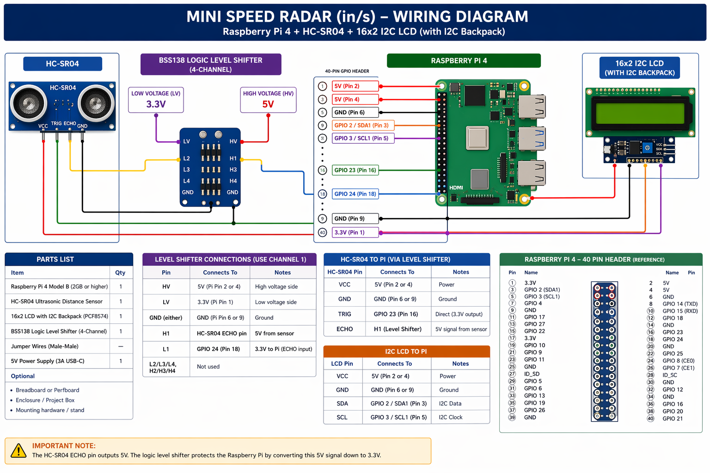

# Hotweels Speed Radar Sign

<div align="center">
  
</div>

A quick-and-dirty speed radar built with a **Raspberry Pi 4**, an **HC-SR04 ultrasonic sensor**, and a **16×2 I2C LCD**. It measures the speed of Hotwheels cars racing down a ramp in **inches/second** and displays live speed + peak speed on the LCD.

---

## Wiring Diagram



---

## Parts List

| Part | Qty | Approx. Price | Link |
|------|-----|---------------|------|
| Raspberry Pi 4 Model B | 1 | ~$35–55 | [raspberrypi.com](https://www.raspberrypi.com/products/raspberry-pi-4-model-b/) |
| HC-SR04 Ultrasonic Sensor | 1 | ~$8 (5-pack) | [ELEGOO 5-pack — Amazon](https://www.amazon.com/s?k=ELEGOO+HC-SR04+ultrasonic+sensor) |
| 16×2 I2C LCD (PCF8574 backpack) | 1 | ~$12 (2-pack) | [GeeekPi 2-pack — Amazon](https://www.amazon.com/GeeekPi-Character-Backlight-Raspberry-Electrical/dp/B07S7PJYM6) |
| BSS138 4-Ch Logic Level Shifter | 1 | ~$7 (10-pack) | [HiLetgo 10-pack — Amazon](https://www.amazon.com/s?k=HiLetgo+BSS138+logic+level+converter) |
| *(alt)* Adafruit BSS138 Shifter | 1 | ~$4 (single) | [Adafruit #757](https://www.adafruit.com/product/757) |
| Breadboard + Jumper Wires | 1 kit | ~$7 (120pcs) | [ELEGOO Dupont Kit — Amazon](https://www.amazon.com/s?k=ELEGOO+120pcs+dupont+jumper+wires) |
| USB-C Power Supply (5V 3A) | 1 | ~$8 | [Official Pi PSU](https://www.raspberrypi.com/products/type-c-power-supply/) |

> For the level shifter — it's usually the tiny blue/purple PCB with `HV`, `LV`, `H1`–`H4`, `L1`–`L4` pins.

---

## Wiring

### HC-SR04 Sensor

> **⚠️ Important:** The Echo pin on the HC-SR04 outputs **5V**. The Pi's GPIO is **3.3V**. You **must** use a level shifter (or voltage divider) on the Echo line or you will damage the Pi.

| HC-SR04 Pin | Level Shifter | Raspberry Pi |
|-------------|---------------|--------------|
| VCC | — (direct) | 5V (Pin 2) |
| GND | — (direct) | GND (Pin 6) |
| TRIG | — (direct) | GPIO 23 (Pin 16) |
| ECHO | → H1 | |
| | L1 → | GPIO 24 (Pin 18) |
| | HV → | 5V (Pin 4) |
| | LV → | 3.3V (Pin 1) |
| | GND → | GND (Pin 9) |

The Trigger pin is fine without a shifter — the Pi outputs 3.3V, and the HC-SR04 reads anything above ~2V as HIGH.

### I2C LCD (16×2)

| LCD Pin | Raspberry Pi |
|---------|--------------|
| VCC | 5V (Pin 2) |
| GND | GND (Pin 6) |
| SDA | GPIO 2 / SDA1 (Pin 3) |
| SCL | GPIO 3 / SCL1 (Pin 5) |

> **Note:** The PCF8574 I2C backpack works fine with the Pi's 3.3V logic levels even though it's powered at 5V. No level shifter needed for the LCD.

---

### Wiring Diagram

```
HC-SR04         Level Shifter         Raspberry Pi 4
────────        ─────────────         ──────────────
VCC  ──────────────────────────────── 5V (Pin 2)
GND  ──────────────────────────────── GND (Pin 6)
TRIG ──────────────────────────────── GPIO 23 (Pin 16)  ← direct, no shifter needed
ECHO ────────── H1
                L1 ────────────────── GPIO 24 (Pin 18)
                HV ────────────────── 5V (Pin 4)
                LV ────────────────── 3.3V (Pin 1)
                GND ───────────────── GND (Pin 9)

I2C LCD (16x2)
──────────
VCC  ──────────────────────────────── 5V (Pin 2)
GND  ──────────────────────────────── GND (Pin 6)
SDA  ──────────────────────────────── GPIO 2 / SDA1 (Pin 3)
SCL  ──────────────────────────────── GPIO 3 / SCL1 (Pin 5)
```

---

## Prerequisites

1. **Enable I2C** on the Pi:
   ```bash
   sudo raspi-config
   # → Interface Options → I2C → Enable
   ```

2. **Install I2C tools** and verify the LCD is detected:
   ```bash
   sudo apt install -y i2c-tools
   i2cdetect -y 1
   ```
   You should see your LCD at address `0x27` (or `0x3F`). If it shows up, you're good.

---

## Install

Create a virtual environment (optional but recommended) and install dependencies:

```bash
python3 -m venv .venv
source .venv/bin/activate
pip install RPLCD smbus2 RPi.GPIO
```

---

## Run

```bash
sudo .venv/bin/python speed_radar.py
```

**Why `sudo`?** GPIO access on the Pi requires root.

**Why `.venv/bin/python`?** Running `sudo python` uses the *system* Python, which doesn't have your venv packages. This tells sudo to use your venv's interpreter instead.

To stop: press **Ctrl+C**. The script will clean up GPIO and display "Radar OFF" on the LCD.

---

## Configuration

All tunable settings are at the top of `speed_radar.py`:

| Variable | Default | Description |
|----------|---------|-------------|
| `TRIG_PIN` | `23` | GPIO pin connected to HC-SR04 Trigger |
| `ECHO_PIN` | `24` | GPIO pin connected to HC-SR04 Echo (via level shifter) |
| `LCD_I2C_ADDR` | `0x27` | I2C address of the LCD; use `0x3F` if `0x27` doesn't work |
| `SAMPLE_INTERVAL` | `0.06` (60ms) | Time between distance readings; lower = faster sampling |
| `ROLLING_WINDOW` | `3` | Number of speed readings to average for smoothing |
| `MAX_RANGE_CM` | `400` | Readings beyond this are discarded as out-of-range |
| `MIN_RANGE_CM` | `2` | Readings below this are discarded (sensor minimum) |
| `ECHO_TIMEOUT` | `0.04` | Seconds to wait for echo before skipping the reading |
| `IDLE_THRESHOLD` | `0.5` | Speed (in/s) below which the display shows 0.0 (noise filter) |

---

## Tuning Tips

| Symptom | Fix |
|---------|-----|
| **Readings are jumpy/noisy** | Increase `ROLLING_WINDOW` to `5` or `7` |
| **Missing fast-moving objects** | Decrease `SAMPLE_INTERVAL` to `0.04` (40ms) |
| **Shows speed when nothing is moving** | Increase `IDLE_THRESHOLD` to `1.0` or higher |
| **Inconsistent readings** | Make sure the sensor points **down the track** so the car moves directly toward or away from it. Side-on won't work. |

---

## LCD Output

```
┌────────────────┐
│Speed: XX.X in/s│  ← Live smoothed speed
│Peak:  XX.X in/s│  ← Fastest reading since script started
└────────────────┘
```

Terminal also prints debug output for each reading:
```
Dist:  45.3 cm | Raw:  32.1 in/s | Avg:  28.7 in/s | Peak:  42.3 in/s
```

---

## Known Limitations

- **Range:** HC-SR04 max practical range is ~4m (13 ft). This is a desk/table-scale project.
- **Cone angle:** ~15–30°. Objects must be moving on-axis (toward or away from the sensor).
- **Minimum distance:** Can't measure below ~2cm. Don't let the car hit the sensor.
- **Not for vehicles.** This is for toy cars, RC cars, and hallway demos. For real vehicle speed, use a doppler radar module (RCWL-0516 or HB100).

---

## License

[MIT](LICENSE) — do whatever you want with it.
